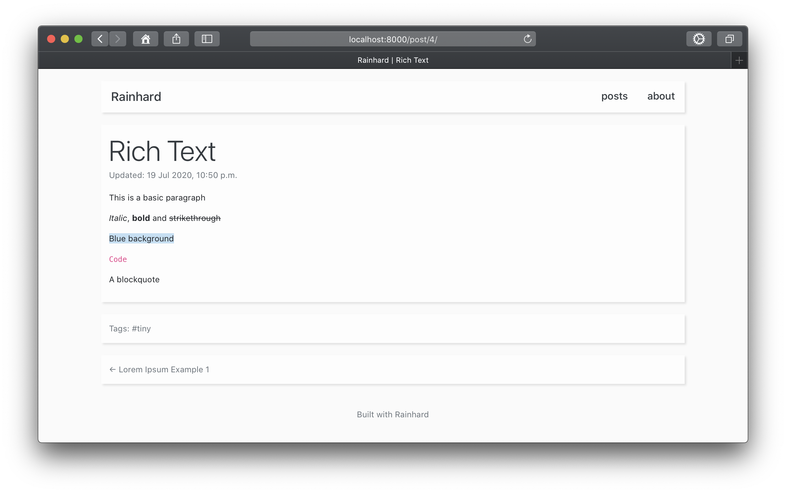
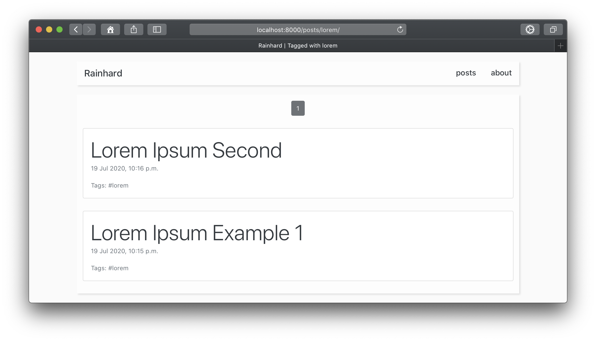
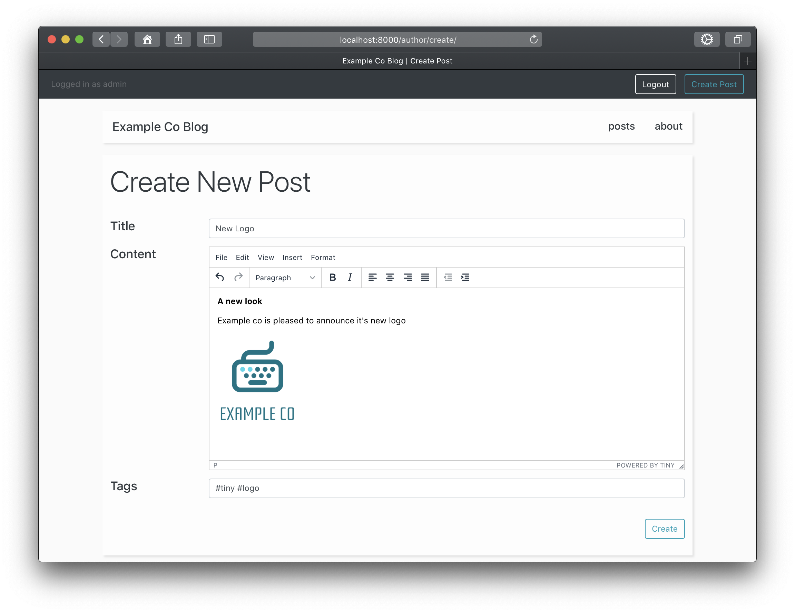
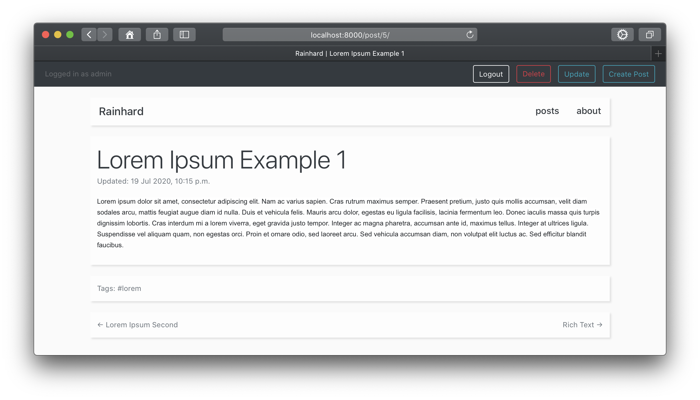

# Rainhard
Rainhard is a simple and clean blogging site built on Django.

It supports

### Rich Text Posts


### Browsing By Tags


### Images


## Author use
Rainhard uses the Django admin page for user creating and managing users.

Navigate to `http://<base_url>/author` to be greeted with a login. A toolbar
will appear at the top of the page for creating posts.

When viewing the page for a post, buttons will for updating and deleting
the post.



## Development 

### TODO
- [x] Basic model setup
- [x] Add views to show posts
- [x] Add basic edit page
- [x] Add user login to manage edit rights
- [x] Add rich text / HTML posts with WYSIWYG editor (Tiny MCE)
- [x] Check ability to add images with rich text editor
- [x] Add better url structure for admin tasks like creating posts
- [ ] Add file dropdown list or browser
- [x] Style and design
- [x] Edit and delete posts
- [x] Docs, landing page, screenshots
- [ ] Example production deployment guide

### Resources Used
Bleach-whitelist was used to whitelist certain HTML tags from
the rich text editor
https://github.com/yourcelf/bleach-whitelist

Bootstrap 4.5 was used for CSS
https://getbootstrap.com/

Tiny MCE is used for the rich text editor
https://www.tiny.cloud/

### Local Settings
A file `rainhard/local_settings.py` must be created to define the
constants shown in the example below.

```python
# These will be shown on the about page
BLOG_NAME = 'Rainhard'
BLOG_ABOUT = 'A blog made with Rainhard.'

# SECURITY WARNING: keep the secret key used in production secret!
SECRET_KEY = '!@#$%^&*()'
# SECURITY WARNING: don't run with debug turned on in production!
DEBUG = False

ALLOWED_HOSTS = ['127.0.0.1', 'localhost']
INTERNAL_IPS = ['127.0.0.1', 'localhost']
# This is set up when creating a Tiny account
TINY_MCE_URL = "https://cdn.tiny.cloud/1/no-api-key/tinymce/5/tinymce.min.js"
```